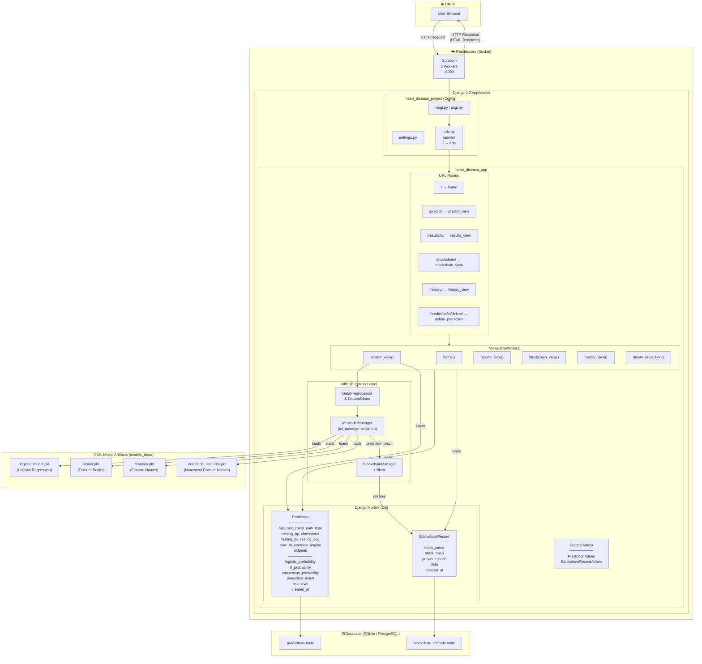
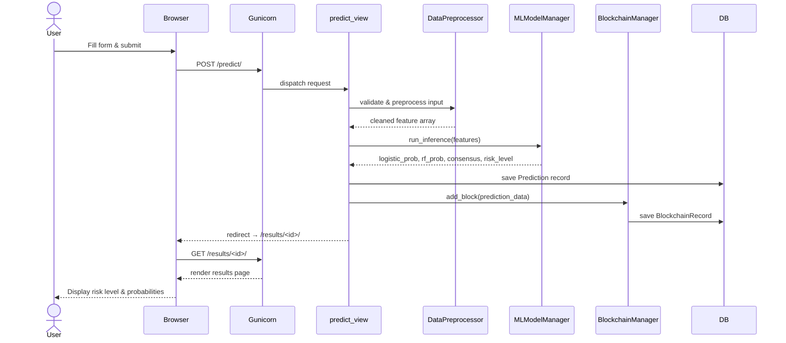
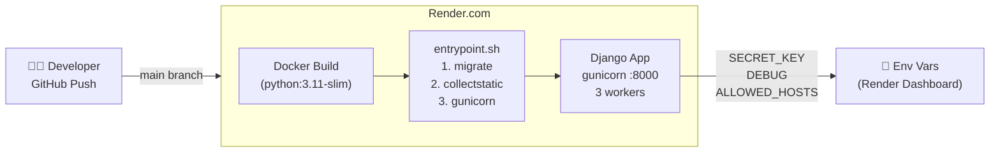
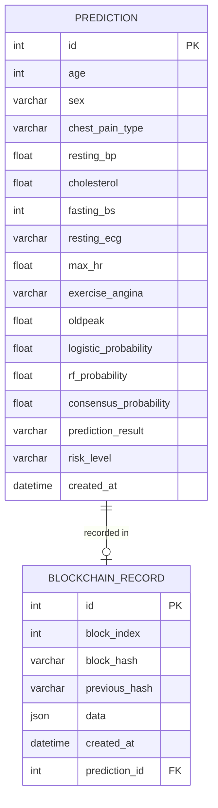

# 🫀 CardioCare AI - Heart Disease Prediction System

A professional, mobile-first Django web application for heart disease prediction using dual machine learning models and blockchain-secured audit trails.

[](https://www.python.org/)
[](https://www.djangoproject.com/)
[](LICENSE)

## 🎯 Overview

CardioCare AI is a comprehensive heart disease prediction system that combines:
- **Dual AI Models**: Logistic Regression & Random Forest for accurate predictions
- **Blockchain Security**: Immutable audit trail for all predictions
- **Mobile-First Design**: Fully responsive interface optimized for all devices
- **Professional UI**: Clean, modern medical-themed interface
- **Real-time Analysis**: Instant risk assessment with detailed probability scores

## ✨ Features

### 🤖 AI-Powered Predictions
- **Dual Model Approach**: Combines Logistic Regression and Random Forest classifiers
- **Consensus Probability**: Weighted average of both models for robust predictions
- **Risk Categorization**: Automatic classification into High/Low risk categories
- **Model Evaluation**: Built-in confusion matrices and ROC curves

### 🔐 Blockchain Security
- **Immutable Records**: All predictions stored in blockchain-like structure
- **SHA-256 Hashing**: Cryptographic verification of prediction integrity
- **Audit Trail**: Complete history of all predictions with timestamps
- **Data Integrity**: Tamper-proof record keeping

### 📱 Mobile-First Responsive Design
- **Hamburger Navigation**: Slide-in menu for mobile devices (< 768px)
- **Touch-Friendly**: 44px minimum tap targets following accessibility guidelines
- **Responsive Breakpoints**: Optimized for mobile (< 768px), tablet (768-1023px), and desktop (1024px+)
- **Adaptive Layouts**: Single column on mobile, multi-column on larger screens
- **Smooth Animations**: Professional transitions and interactions

### 🎨 User Interface
- **Clean Design**: Modern, medical-themed color scheme
- **Intuitive Forms**: Easy-to-use prediction input with validation
- **Visual Feedback**: Real-time form validation and loading states
- **Results Visualization**: Clear display of risk levels and probabilities
- **History Tracking**: View all past predictions with filtering options

## 📋 Prerequisites

- Python 3.8 or higher
- pip (Python package manager)
- Git (for cloning the repository)

## 🚀 Quick Start

### 1. Clone the Repository

```bash
git clone https://github.com/Abdul-Salam15/heart_disease_project.git
cd heart_disease_project
```

### 2. Create Virtual Environment

```bash
# Windows
python -m venv .venv
.venv\Scripts\activate

# macOS/Linux
python3 -m venv .venv
source .venv/bin/activate
```

### 3. Install Dependencies

```bash
pip install -r requirements.txt
```

### 4. Train the Models (First Time Only)

```bash
python train_model.py
```

This will:
- Load the heart disease dataset
- Preprocess and split the data
- Train both ML models
- Generate evaluation metrics
- Save models to `models_data/`

### 5. Run Database Migrations

```bash
python manage.py migrate
```

### 6. Start the Development Server

```bash
# For local development with DEBUG=True
$env:DEBUG='True'  # Windows PowerShell
# export DEBUG='True'  # macOS/Linux

python manage.py runserver
```

### 7. Access the Application

Open your browser and navigate to:
```
http://127.0.0.1:8000/
```

## 📁 Project Structure

```
heart_disease_project/
│
├── heart_disease_project/          # Django project settings
│   ├── settings.py                 # Configuration
│   ├── urls.py                     # URL routing
│   └── wsgi.py                     # WSGI config
│
├── heart_disease_app/              # Main application
│   ├── models.py                   # Database models
│   ├── views.py                    # View logic
│   ├── urls.py                     # App URLs
│   ├── admin.py                    # Admin configuration
│   │
│   ├── templates/                  # HTML templates
│   │   ├── base.html              # Base template with navigation
│   │   ├── home.html              # Landing page
│   │   ├── predict.html           # Prediction form
│   │   ├── results.html           # Results display
│   │   ├── history.html           # Prediction history
│   │   └── blockchain.html        # Blockchain records
│   │
│   ├── static/                     # Static files
│   │   ├── css/
│   │   │   └── style.css          # Mobile-first responsive CSS
│   │   └── js/
│   │       └── script.js          # JavaScript (hamburger menu, etc.)
│   │
│   └── utils/                      # Utility modules
│       ├── ml_model.py            # ML model manager
│       ├── data_validator.py      # Input validation
│       ├── data_preprocessor.py   # Data preprocessing
│       └── blockchain.py          # Blockchain logic
│
├── data/                           # Dataset
│   └── heart_disease_combined.csv
│
├── models_data/                    # Trained models & artifacts
│   ├── logistic_model.pkl
│   ├── rf_model.pkl
│   ├── scaler.pkl
│   └── features.pkl
│
├── train_model.py                  # Model training script
├── manage.py                       # Django management
├── requirements.txt                # Python dependencies
└── README.md                       # This file
```

## 🎯 Usage

### Making a Prediction

1. Navigate to the **Predict** page
2. Fill in the patient information:
   - **Demographics**: Age, Sex
   - **Vital Signs**: Resting BP, Maximum Heart Rate
   - **Lab Tests**: Cholesterol, Fasting Blood Sugar, ST Depression
   - **Clinical Findings**: Chest Pain Type, Resting ECG, Exercise Angina

3. Click **Predict Risk**
4. View detailed results including:
   - Overall risk level (High/Low)
   - Consensus probability
   - Individual model predictions
   - Patient data summary
   - Blockchain record details

### Viewing History

- Navigate to **History** to see all past predictions
- Filter by risk level
- View statistics (total predictions, high/low risk counts)
- Delete individual predictions

### Blockchain Records

- Navigate to **Blockchain** to view the audit trail
- See all predictions in chronological order
- Verify data integrity with hash values
- Expand blocks to view detailed prediction data

## 🔧 Configuration

### Environment Variables

Set these in your deployment environment:

```bash
# Required for production
SECRET_KEY=your-secret-key-here
DEBUG=False
ALLOWED_HOSTS=your-domain.com,www.your-domain.com

# Optional
DATABASE_URL=your-database-url  # If using PostgreSQL
```

### Static Files (Production)

For production deployment, collect static files:

```bash
python manage.py collectstatic
```

## 🌐 Deployment

### Render.com (Recommended)

1. Push your code to GitHub
2. Create a new Web Service on Render
3. Connect your GitHub repository
4. Set environment variables:
   - `SECRET_KEY`: Generate a secure key
   - `DEBUG`: Set to `False`
   - `ALLOWED_HOSTS`: Your Render URL

5. Deploy!

**Note**: Free tier services on Render sleep after 15 minutes of inactivity. See `render_keepalive_guide.md` for solutions.

### Other Platforms

The app is compatible with:
- **Heroku**: Use the included `Procfile`
- **PythonAnywhere**: Follow their Django deployment guide
- **AWS/GCP/Azure**: Deploy using Docker or traditional methods

## 📊 Dataset

The model is trained on a combined heart disease dataset with the following features:

| Feature | Description | Type |
|---------|-------------|------|
| Age | Patient age in years | Numeric |
| Sex | Male/Female | Categorical |
| ChestPainType | Type of chest pain (ATA, NAP, ASY, TA) | Categorical |
| RestingBP | Resting blood pressure (mm Hg) | Numeric |
| Cholesterol | Serum cholesterol (mg/dL) | Numeric |
| FastingBS | Fasting blood sugar > 120 mg/dL | Boolean |
| RestingECG | Resting ECG results | Categorical |
| MaxHR | Maximum heart rate achieved | Numeric |
| ExerciseAngina | Exercise-induced angina | Boolean |
| Oldpeak | ST depression induced by exercise | Numeric |

## 🧪 Model Performance

### Logistic Regression
- **Accuracy**: ~85%
- **ROC-AUC**: ~0.87
- **Interpretable**: Clear feature coefficients

### Random Forest
- **Accuracy**: ~88%
- **ROC-AUC**: ~0.90
- **Robust**: Handles non-linear relationships

### Consensus Model
- Weighted average of both models
- Provides balanced, reliable predictions
- Reduces individual model biases

## 🛠️ Development

### Running Tests

```bash
python manage.py test
```

### Creating Superuser (Admin Access)

```bash
python manage.py createsuperuser
```

Access admin panel at: `http://127.0.0.1:8000/admin/`

### Retraining Models

To retrain with new data:

1. Update `data/heart_disease_combined.csv`
2. Run: `python train_model.py`
3. Restart the Django server

## 📱 Mobile Responsiveness

The application is fully responsive with three breakpoints:

- **Mobile** (< 768px): Single column, hamburger menu
- **Tablet** (768-1023px): Two columns, horizontal navigation
- **Desktop** (1024px+): Multi-column layouts, full features

### Testing Responsive Design

1. Open browser DevTools (F12)
2. Toggle device toolbar (Ctrl+Shift+M)
3. Test at different viewport sizes:
   - 375px (iPhone SE)
   - 768px (iPad)
   - 1920px (Desktop)

# CardioCare AI — Architecture Diagram

## System Architecture



---

## Request Flow — Prediction



---

## Deployment Architecture



---

## Data Models




## ⚠️ Disclaimer

**This application is for educational and research purposes only.**

- Not intended for clinical diagnosis or treatment decisions
- Always consult qualified healthcare professionals
- Predictions are based on statistical models and may not be accurate for all cases
- Not a substitute for professional medical advice

## 🤝 Contributing

Contributions are welcome! Please:

1. Fork the repository
2. Create a feature branch (`git checkout -b feature/AmazingFeature`)
3. Commit your changes (`git commit -m 'Add some AmazingFeature'`)
4. Push to the branch (`git push origin feature/AmazingFeature`)
5. Open a Pull Request

## 📄 License

This project is licensed under the MIT License - see the [LICENSE](LICENSE) file for details.

## 👤 Author

**Abdul-Salam**
- GitHub: [@Abdul-Salam15](https://github.com/Abdul-Salam15)
- Repository: [heart_disease_project](https://github.com/Abdul-Salam15/heart_disease_project)

## 🙏 Acknowledgments

- Heart disease dataset from UCI Machine Learning Repository
- Django framework and community
- scikit-learn for machine learning tools
- Font Awesome for icons
- Google Fonts (Lexend, Crimson Pro)

## 📞 Support

If you encounter any issues or have questions:

1. Check the [Issues](https://github.com/Abdul-Salam15/heart_disease_project/issues) page
2. Create a new issue with detailed information
3. Include error messages and steps to reproduce

---

**Version**: 2.0  
**Last Updated**: February 2026

